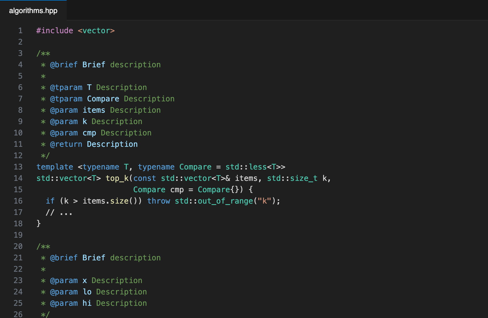

# Doxline — Doxygen & Javadoc Comments

**Type `/**` above a declaration and get a complete doc comment.** Doxline reads C and C++ (and Java) declarations — templates, parameters, return types, constructors, operators, macros — and writes a Doxygen block with tab stops for every description.

A fast, **actively maintained** alternative to *Doxygen Documentation Generator*. Works offline; no AI or API keys needed.

## How to use

- Type `/**` on the line above a function, class, struct, enum or `#define` → pick **Generate Doxygen Comment**.
- Or put the cursor on the declaration and press <kbd>Ctrl+Alt+D</kbd> / <kbd>⌘⌥D</kbd>, or right-click → **Generate Doc Comment**.
- Press <kbd>Tab</kbd> to jump between descriptions.

## What it understands

- Functions and methods, including multi-line signatures and trailing return types (`auto f() -> T`)
- `template <…>` parameters → `@tparam` (defaults and packs handled)
- Pointers, references, arrays, default values, function-pointer parameters, unnamed and variadic parameters
- Constructors/destructors (no `@return`), `void` returns (no `@return`), operators, qualified names (`ns::Class::method`)
- Classes, structs, unions, enums (`enum class`) and function-like macros (`#define CLAMP(x, lo, hi)`)
- **Java**: modifiers, annotations, generic methods (`<T extends …>` → `@tparam`), `throws` clauses → `@throws`

## Doxline Pro

Part of the one-time **Branchline Pro** license (no subscription):

- **Document an entire file at once** — right-click → *Generate Doc Comments for Entire File* adds comments to every undocumented declaration at namespace/class scope.
- Pro features in all Branchline extensions: [Branchline](https://marketplace.visualstudio.com/items?itemName=branchline.branchline), [TODO Lens](https://marketplace.visualstudio.com/items?itemName=branchline.todo-lens), [Snapline](https://marketplace.visualstudio.com/items?itemName=branchline.snapline-code-screenshots), [Docline](https://marketplace.visualstudio.com/items?itemName=branchline.docline-python-docstring-generator).

Run **`Doxline: Get Doxline Pro`**, then **`Doxline: Enter Pro License Key`**.

## Settings

| Setting | Default | Description |
| --- | --- | --- |
| `doxline.commandPrefix` | `@` | `@param` or `\param` style |
| `doxline.includeBrief` | `true` | Start with `@brief` |
| `doxline.placeholder` | `Description` | Placeholder text |

## Also by the author

- **[Docline — Instant Python Docstrings](https://marketplace.visualstudio.com/items?itemName=branchline.docline-python-docstring-generator)** — the same idea for Python.
- **[Branchline — Git Graph](https://marketplace.visualstudio.com/items?itemName=branchline.branchline)** · **[TODO Lens](https://marketplace.visualstudio.com/items?itemName=branchline.todo-lens)** · **[Snapline](https://marketplace.visualstudio.com/items?itemName=branchline.snapline-code-screenshots)**

## Support

Free and maintained by one developer. If it saves you time, you can [chip in from $1](https://dealership6.gumroad.com/l/support).

## License

Source-available under the [Doxline License](LICENSE): free to use, read and learn from; redistribution and derivative publications are not permitted.
